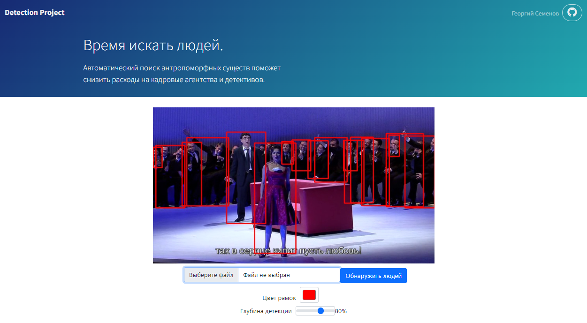

# DLSProject

Frontend & Backend project for human image detection

:student: The following project was conducted during MIPT Deep Learning School, Autumn semester 2021

## Description

Layout is created using Bootstrap Studio, backend is written as a Flask Python Application.

Pre-trained model `fasterrcnn_resnet50_fpn` is used.



## Build & Run

```bash
python3 -m venv venv
source venv/bin/activate
cd ..
pip3 install -r requirements.txt

python3 run.py
```